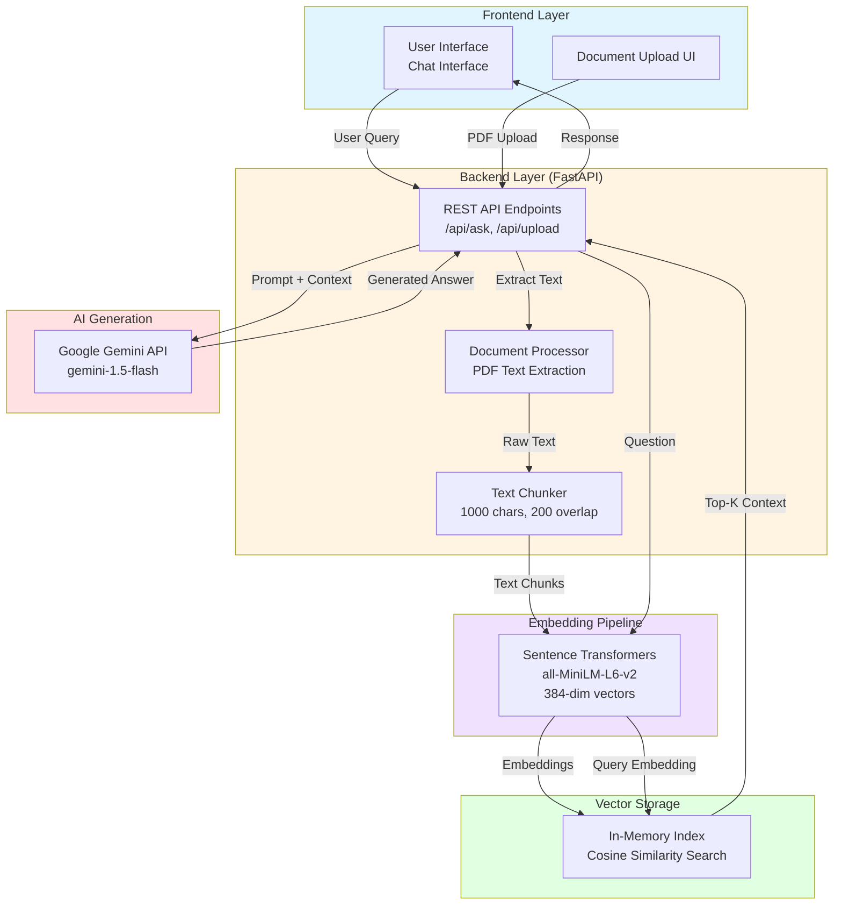
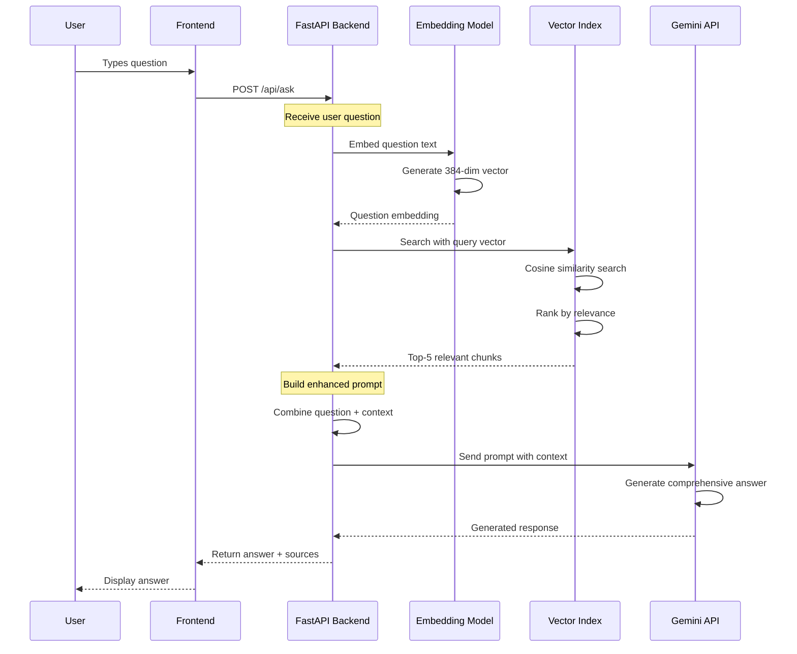
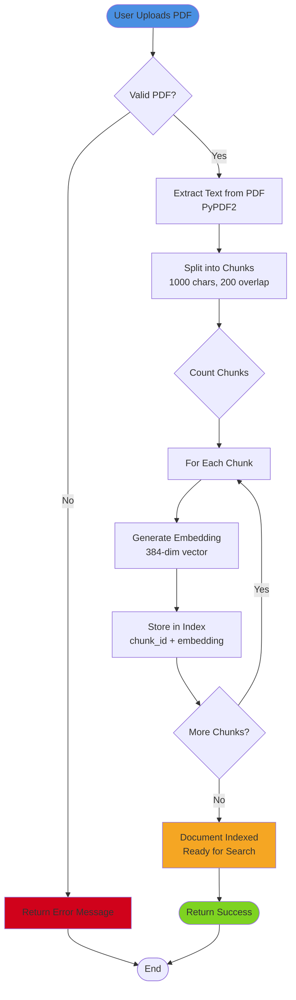

# 🎓 Learnix - AI-Powered Study Assistant

Learnix is an intelligent study companion that uses Retrieval-Augmented Generation (RAG) to help students get comprehensive answers from their course materials. Upload your lecture notes, textbooks, and study materials, then ask questions in natural language to receive detailed, context-aware answers.


## 🌟 Features

- 📚 **Smart Document Processing** - Upload PDFs and automatically extract, chunk, and index content
- 🔍 **Semantic Search** - Find relevant information using AI-powered vector search
- 🤖 **AI-Generated Answers** - Get comprehensive explanations powered by Google Gemini
- 💬 **Natural Conversations** - Ask questions in plain English
- 📖 **Source Citations** - Every answer includes references to your uploaded materials
- 🎨 **Modern UI** - Clean, responsive interface with dark/light theme support
- ⚡ **Fast & Efficient** - In-memory vector storage for quick retrieval

## 🏗️ System Architecture



## 🔄 How RAG Works in Learnix



## 🚀 Quick Start

### Prerequisites

- Python 3.10 or higher
- Google Gemini API key ([Get one here](https://makersuite.google.com/app/apikey))
- 2GB+ RAM (for embedding model)

### Installation

1. **Clone the repository**
   ```bash
   git clone https://github.com/yourusername/learnix.git
   cd learnix
   ```

2. **Create virtual environment**
   ```bash
   python -m venv .venv
   
   # Windows
   .venv\Scripts\activate
   
   # Linux/Mac
   source .venv/bin/activate
   ```

3. **Install dependencies**
   ```bash
   cd college-ai-backend
   pip install -r requirements.txt
   ```

4. **Set up environment variables**
   ```bash
   # Create .env file
   echo "GEMINI_API_KEY=your_api_key_here" > .env
   ```

5. **Run the server**
   ```bash
   uvicorn app:app --host 127.0.0.1 --port 8000
   ```

6. **Open your browser**
   Navigate to `http://127.0.0.1:8000`

## 📖 Usage Guide

### Uploading Documents

1. Click the **"Upload Document"** button
2. Select one or more PDF files (lecture notes, textbooks, etc.)
3. Wait for processing (you'll see progress in the terminal)
4. Once indexed, you can start asking questions!

### Asking Questions

Simply type your question in natural language:

**Examples:**
- "What is polymorphism in Java?"
- "Explain the difference between arrays and linked lists"
- "How does inheritance work in OOP?"
- "What are the key principles of object-oriented programming?"

### Getting Better Answers

✅ **Do:**
- Be specific in your questions
- Ask about topics covered in your uploaded materials
- Use technical terms from your course
- Ask follow-up questions for clarification

❌ **Don't:**
- Ask about topics not in your documents (answers will be generic)
- Use vague questions like "Tell me about Java"
- Expect answers on topics you haven't uploaded

## 🛠️ Technology Stack

### Frontend
- **HTML/CSS/JavaScript** - Vanilla web technologies
- **Fetch API** - Backend communication
- **LocalStorage** - Theme persistence

### Backend
- **FastAPI** - Modern Python web framework
- **Uvicorn** - ASGI server
- **PyPDF2** - PDF text extraction
- **Sentence Transformers** - Text embeddings (all-MiniLM-L6-v2)
- **NumPy** - Vector operations
- **Google Gemini** - LLM for answer generation

### Architecture Patterns
- **RAG (Retrieval-Augmented Generation)** - Combine search + generation
- **Vector Search** - Semantic similarity matching
- **RESTful API** - Clean endpoint design
- **MVC Pattern** - Separated concerns

## 📊 Data Flow



## 📁 Project Structure

```
learnix/
├── assets/
│   └── diagrams/              # System diagrams (Mermaid)
│       ├── system-architecture.md
│       ├── data-flow.md
│       └── how-it-works.md
├── college-ai-backend/
│   ├── app.py                 # Main FastAPI application
│   ├── frontend/              # Static web files
│   │   ├── index.html
│   │   ├── styles.css
│   │   └── app.js
│   ├── utils/                 # Core utilities
│   │   ├── chunker.py         # Text chunking logic
│   │   ├── embeddings.py      # Embedding generation
│   │   ├── gemini.py          # Gemini API integration
│   │   ├── rag.py             # RAG pipeline
│   │   └── storage.py         # Vector storage
│   ├── data/                  # Uploaded PDFs
│   ├── requirements.txt       # Python dependencies
│   ├── .env                   # API keys (not in git)
│   └── INSTRUCTIONS.md        # Detailed setup guide
└── README.md                  # This file
```

## 🔧 Configuration

### Environment Variables (.env)

```bash
GEMINI_API_KEY=your_gemini_api_key_here
```

### Adjustable Parameters (app.py)

```python
# Chunking configuration
CHUNK_SIZE = 1000          # Characters per chunk
CHUNK_OVERLAP = 200        # Overlap between chunks

# Retrieval configuration
TOP_K = 5                  # Number of chunks to retrieve

# Embedding model
MODEL_NAME = "sentence-transformers/all-MiniLM-L6-v2"

# Gemini settings
TEMPERATURE = 0.7          # Response creativity (0-1)
MAX_OUTPUT_TOKENS = 2048   # Maximum response length
```

## 🎯 API Endpoints

| Endpoint | Method | Description |
|----------|--------|-------------|
| `/` | GET | Frontend UI |
| `/api/health` | GET | Health check |
| `/api/ask/` | POST | Ask a question |
| `/api/upload/` | POST | Upload PDF document |
| `/api/documents/` | GET | List all documents |
| `/api/download/{filename}` | GET | Download document |

### Example API Usage

**Ask a Question:**
```bash
curl -X POST http://127.0.0.1:8000/api/ask/ \
  -H "Content-Type: application/json" \
  -d '{"question": "What is polymorphism?"}'
```

**Upload a Document:**
```bash
curl -X POST http://127.0.0.1:8000/api/upload/ \
  -F "file=@/path/to/document.pdf"
```

## 🐛 Troubleshooting

### Server won't start
- **Issue**: Port 8000 already in use
- **Solution**: Kill existing process or use different port
  ```bash
  # Windows
  netstat -ano | findstr :8000
  taskkill /PID <process_id> /F
  
  # Linux/Mac
  lsof -ti:8000 | xargs kill -9
  ```

### Documents not loading
- **Issue**: Embedding model download failed
- **Solution**: Check internet connection, model will auto-download on first run

### Empty or generic answers
- **Issue**: No relevant documents uploaded
- **Solution**: Upload course materials before asking questions

### API key errors
- **Issue**: Invalid or missing Gemini API key
- **Solution**: Check `.env` file has correct `GEMINI_API_KEY`

For more troubleshooting, see [INSTRUCTIONS.md](college-ai-backend/INSTRUCTIONS.md)

## 📈 Performance

- **Document Processing**: ~2-3 seconds per 100 chunks
- **Question Embedding**: ~50ms
- **Vector Search**: ~10ms for 5000 chunks
- **Gemini API**: ~1-3 seconds (depends on response length)
- **Total Response Time**: ~2-4 seconds average

## 🔐 Security & Privacy

- ✅ All documents stored **locally** on your machine
- ✅ No data sent to third parties (except Gemini API for generation)
- ✅ Gemini doesn't store your queries or documents
- ✅ API keys stored in `.env` (never committed to git)
- ✅ CORS configured for localhost only

## 🤝 Contributing

Contributions are welcome! Here's how:

1. Fork the repository
2. Create a feature branch (`git checkout -b feature/amazing-feature`)
3. Commit your changes (`git commit -m 'Add amazing feature'`)
4. Push to branch (`git push origin feature/amazing-feature`)
5. Open a Pull Request

## 📝 License

This project is licensed under the MIT License - see the [LICENSE](LICENSE) file for details.

## 🙏 Acknowledgments

- **Google Gemini** - Powerful LLM for answer generation
- **Sentence Transformers** - Excellent embedding models
- **FastAPI** - Modern, fast web framework
- **Hugging Face** - Model hosting and transformers library

## 📚 Additional Resources

- [How Learnix Works](assets/diagrams/how-it-works.md) - Detailed visual guide
- [System Architecture](assets/diagrams/system-architecture.md) - Technical diagrams
- [Data Flow](assets/diagrams/data-flow.md) - Process diagrams
- [Setup Instructions](college-ai-backend/INSTRUCTIONS.md) - Comprehensive guide

## 💡 Future Enhancements

- [ ] Support for more file formats (DOCX, TXT, Markdown)
- [ ] Persistent vector storage (Qdrant integration)
- [ ] Multi-user support with authentication
- [ ] Conversation history and bookmarks
- [ ] Advanced search filters
- [ ] Mobile-responsive design improvements
- [ ] Export answers to PDF/Markdown
- [ ] Batch document upload
- [ ] Custom chunking strategies

## 📞 Support

For issues, questions, or suggestions:
- 🐛 [Report a bug](https://github.com/yourusername/learnix/issues)
- 💬 [Ask a question](https://github.com/yourusername/learnix/discussions)
- ✨ [Request a feature](https://github.com/yourusername/learnix/issues)

---

**Made with ❤️ for students who want to study smarter, not harder!**

*Learnix - Your AI-powered study companion* 🎓✨
# learnix-Ai

