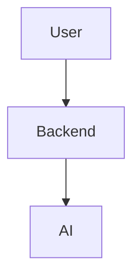

# Learnix Diagrams Index

This directory contains comprehensive visual diagrams explaining the Learnix system architecture, data flow, and RAG process.

## 📁 Files Overview

### 1. [System Architecture](system-architecture.md)
**Purpose**: Complete technical overview of Learnix components

**Includes**:
- Complete system overview diagram
- Technology stack visualization
- Component details and responsibilities
- Deployment architecture

**Best for**: Developers, technical documentation, system understanding

---

### 2. [Data Flow Diagrams](data-flow.md)
**Purpose**: Detailed process flows and sequence diagrams

**Includes**:
- RAG (Retrieval-Augmented Generation) sequence diagram
- Document ingestion flowchart
- Question answering flow
- Embedding generation process
- Request-response cycle
- System state transitions

**Best for**: Understanding how data moves through the system, debugging, optimization

---

### 3. [How It Works](how-it-works.md)
**Purpose**: User-friendly visual explanations

**Includes**:
- Simple visual overview
- Step-by-step process diagrams
- RAG magic explained
- Benefits comparison (RAG vs Traditional AI)
- Simplified technical architecture
- Example user journey
- Performance metrics
- Security & privacy visualization

**Best for**: End users, presentations, teaching, onboarding

---

## 🎨 Diagram Types Used

All diagrams use **Mermaid syntax** for easy rendering in:
- GitHub README
- VS Code (with Mermaid extension)
- Documentation sites
- Markdown viewers

### Mermaid Diagram Categories

1. **Flowcharts** (`graph TB`, `flowchart TD`)
   - System architecture
   - Process flows
   - Decision trees

2. **Sequence Diagrams** (`sequenceDiagram`)
   - RAG process
   - API interactions
   - User workflows

3. **State Diagrams** (`stateDiagram-v2`)
   - System states
   - Application lifecycle

4. **Journey Maps** (`journey`)
   - User experience flows

5. **Pie Charts** (`pie`)
   - Performance metrics
   - Time distribution

---

## 🚀 Quick Start

### Viewing Diagrams

**GitHub**: Diagrams render automatically when viewing `.md` files

**VS Code**:
1. Install "Markdown Preview Mermaid Support" extension
2. Open any diagram file
3. Press `Ctrl+Shift+V` (or `Cmd+Shift+V` on Mac)

**Online**:
- [Mermaid Live Editor](https://mermaid.live/)
- Copy diagram code and paste to visualize

### Embedding in Your Docs

```markdown
# Include in README


# Or use raw Mermaid code

```

---

## 📖 Usage Guide

### For Developers

1. **Start with**: [System Architecture](system-architecture.md)
   - Understand all components
   - See technology stack
   - Learn API structure

2. **Deep dive**: [Data Flow Diagrams](data-flow.md)
   - Trace data through system
   - Understand timing
   - Debug issues

3. **Reference**: Component details in each file

### For Users/Students

1. **Start with**: [How It Works](how-it-works.md)
   - Simple explanations
   - Visual examples
   - Benefits overview

2. **Explore**: Frontend `about.html`
   - Interactive web page
   - Styled diagrams
   - Easy navigation

### For Documentation

1. **Main README**: Include architecture overview
2. **API Docs**: Reference sequence diagrams
3. **User Guide**: Link to "How It Works"

---

## 🎯 Diagram Selection Guide

| Your Need | Recommended Diagram |
|-----------|-------------------|
| "What is Learnix?" | how-it-works.md → Overview |
| "How does RAG work?" | data-flow.md → RAG Process |
| "What tech is used?" | system-architecture.md → Tech Stack |
| "How do I upload docs?" | data-flow.md → Ingestion Flow |
| "What happens when I ask?" | data-flow.md → Question Flow |
| "How fast is it?" | how-it-works.md → Performance |
| "Is it secure?" | how-it-works.md → Security |
| "Full system view?" | system-architecture.md → Complete Overview |

---

## 🔧 Customization

### Updating Diagrams

1. **Edit Mermaid code** in `.md` files
2. **Test locally** with VS Code preview
3. **Verify on GitHub** after commit

### Color Schemes

Current color palette (customizable):
- Frontend: `#e1f5ff` (light blue)
- Backend: `#fff4e1` (light orange)
- Embedding: `#f0e1ff` (light purple)
- Storage: `#e1ffe1` (light green)
- LLM: `#ffe1e1` (light red)

### Adding New Diagrams

1. Create new `.md` file in this directory
2. Use consistent Mermaid syntax
3. Update this README index
4. Link from main project README

---

## 📊 Diagram Statistics

- **Total Diagrams**: 15+
- **Diagram Types**: 6 (flowchart, sequence, state, journey, pie, graph)
- **Lines of Mermaid Code**: ~500+
- **Coverage**: Complete system (frontend to AI)

---

## 🤝 Contributing

### Adding Diagrams

1. Follow existing Mermaid syntax style
2. Use consistent color scheme
3. Add clear labels and notes
4. Test rendering in multiple viewers
5. Update this index file

### Improving Existing

1. Keep diagrams simple and clear
2. Avoid overcrowding
3. Use subgraphs for organization
4. Add helpful notes and annotations

---

## 📚 Resources

### Mermaid Documentation
- [Official Docs](https://mermaid.js.org/)
- [Flowchart Syntax](https://mermaid.js.org/syntax/flowchart.html)
- [Sequence Diagrams](https://mermaid.js.org/syntax/sequenceDiagram.html)
- [Live Editor](https://mermaid.live/)

### VS Code Extensions
- **Markdown Preview Mermaid Support** (recommended)
- **Mermaid Markdown Syntax Highlighting**
- **Markdown Preview Enhanced**

### Online Tools
- [Mermaid Live Editor](https://mermaid.live/) - Test diagrams
- [GitHub Mermaid Support](https://github.blog/2022-02-14-include-diagrams-markdown-files-mermaid/) - Native rendering

---

## 🎨 Example Usage

### In README.md

```markdown
## System Architecture

Our system uses a modern RAG architecture:

[View detailed architecture →](assets/diagrams/system-architecture.md)


```

### In Documentation

```markdown
# Data Flow

When you ask a question, here's what happens:


```

### In Frontend

```html
<a href="about.html">How Learnix Works</a>
<!-- Includes styled, interactive diagrams -->
```

---

## ✨ Future Enhancements

- [ ] Add deployment architecture diagram
- [ ] Create database schema (when Qdrant is integrated)
- [ ] Add error handling flowcharts
- [ ] Include scaling architecture
- [ ] Add API endpoint diagrams
- [ ] Create mobile architecture view
- [ ] Add monitoring & logging flows

---

**Made with ❤️ for clear, beautiful documentation**

*All diagrams are MIT licensed - feel free to use and modify!*
