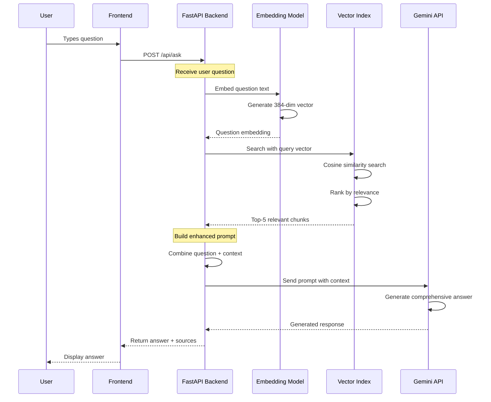
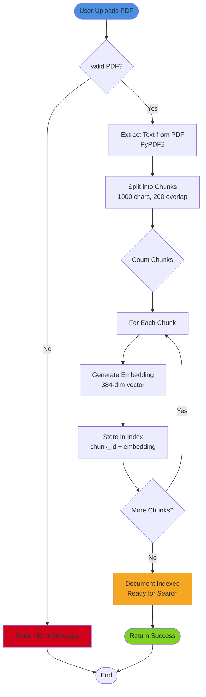
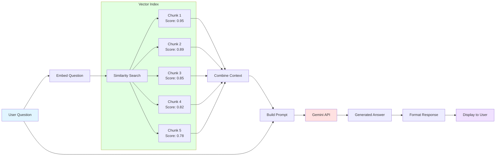
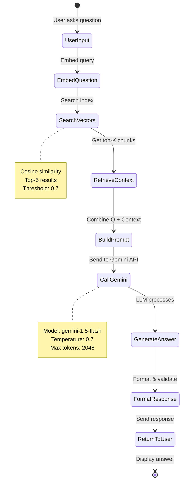
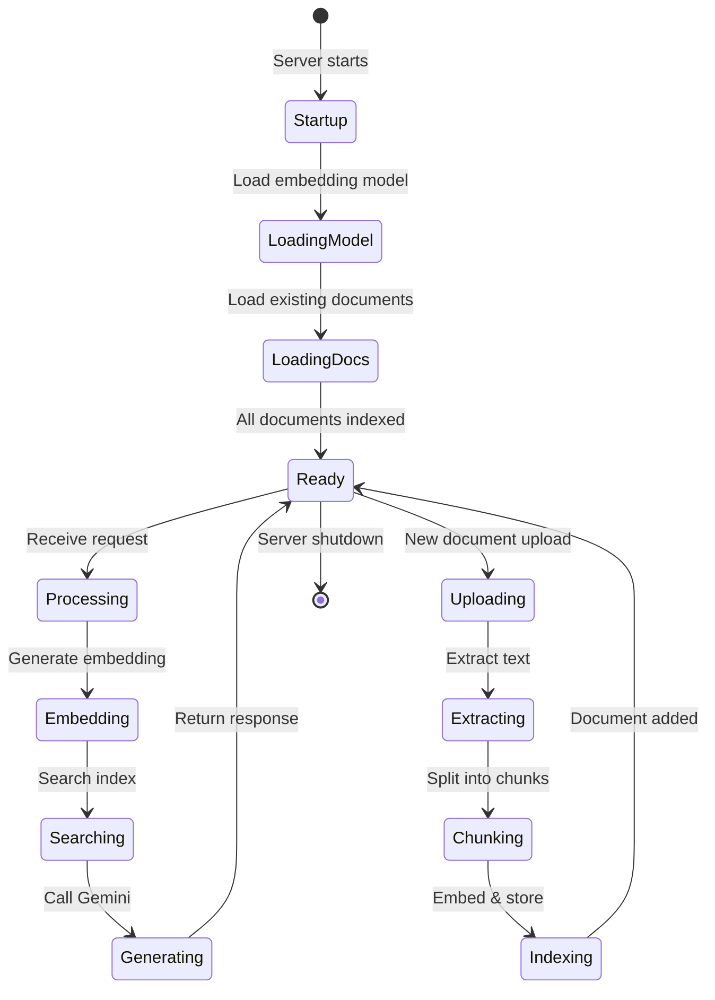

# Learnix Data Flow Diagrams

## RAG (Retrieval-Augmented Generation) Process



## Document Ingestion Flow



## Question Answering Flow



## Embedding Generation Process

```mermaid
graph TD
    Input[Input Text] --> Tokenize[Tokenize<br/>WordPiece Tokenizer]
    Tokenize --> BERT[BERT-based Encoder<br/>6 layers, 384 hidden]
    
    BERT --> Pool[Mean Pooling<br/>Average token embeddings]
    Pool --> Norm[L2 Normalization<br/>Unit vector]
    
    Norm --> Vector[384-dim Vector<br/>[-0.5, 0.2, 0.8, ...]]
    
    Vector --> Compare{Purpose}
    Compare -->|Storage| DB[(Vector Index)]
    Compare -->|Search| Sim[Cosine Similarity]
    
    style Input fill:#e1f5ff
    style BERT fill:#f0e1ff
    style Vector fill:#ffe1e1
    style DB fill:#e1ffe1
```

## Complete Request-Response Cycle



## System State Transitions


