# How Learnix Works

## Overview

Learnix is an AI-powered study assistant that helps students get comprehensive answers from their course materials using Retrieval-Augmented Generation (RAG).

## Simple Visual Explanation

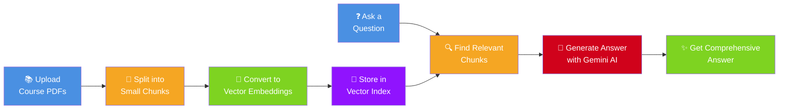

## Step-by-Step Process

### 1️⃣ Document Upload & Processing

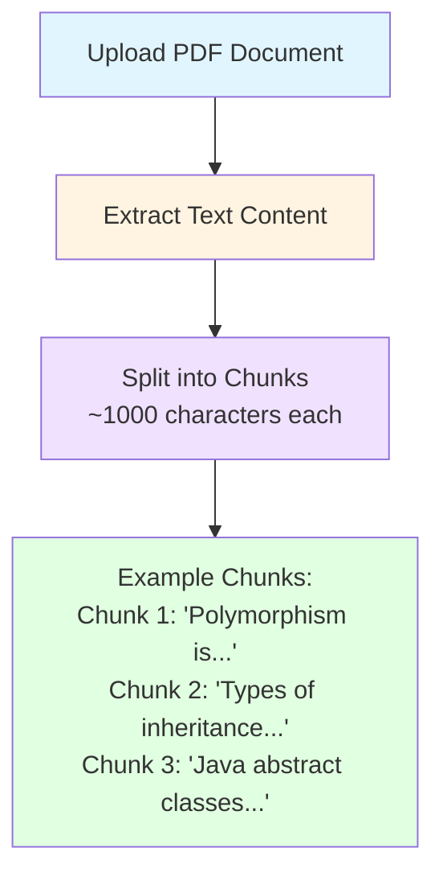

### 2️⃣ Creating Searchable Embeddings

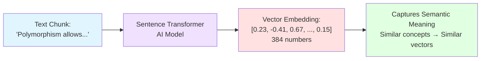

### 3️⃣ Asking Questions

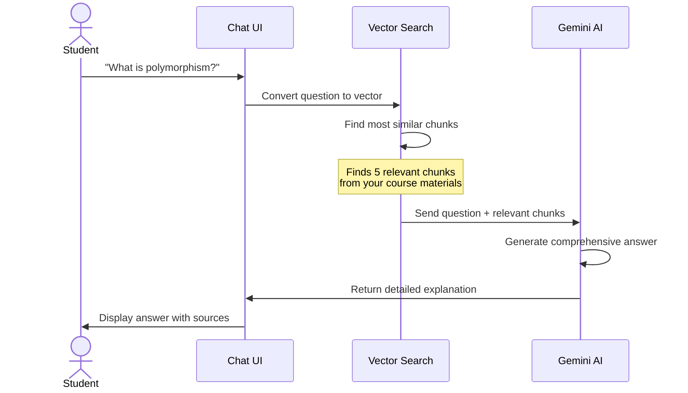

### 4️⃣ RAG Magic Explained

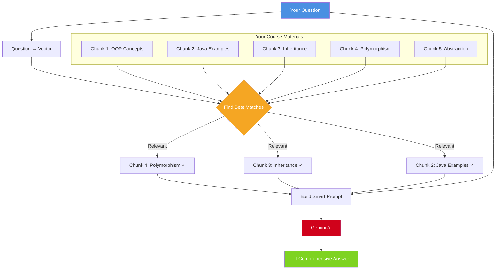

## Key Benefits

### Why RAG is Better Than Just AI

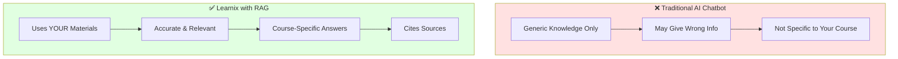

## Technical Architecture (Simplified)

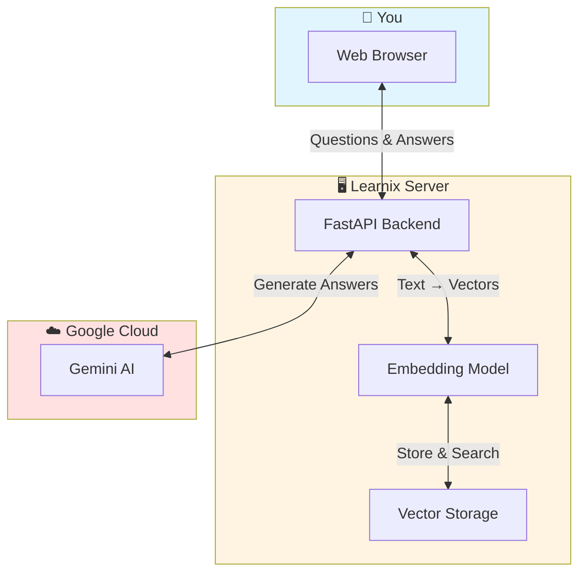

## Example Flow

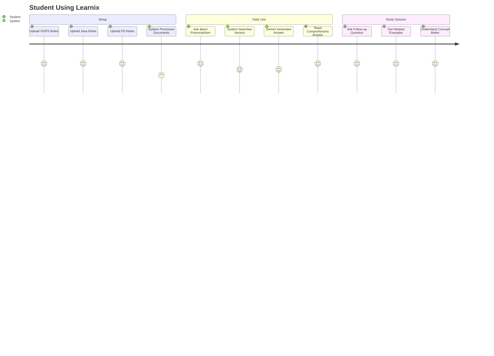

## Performance Metrics

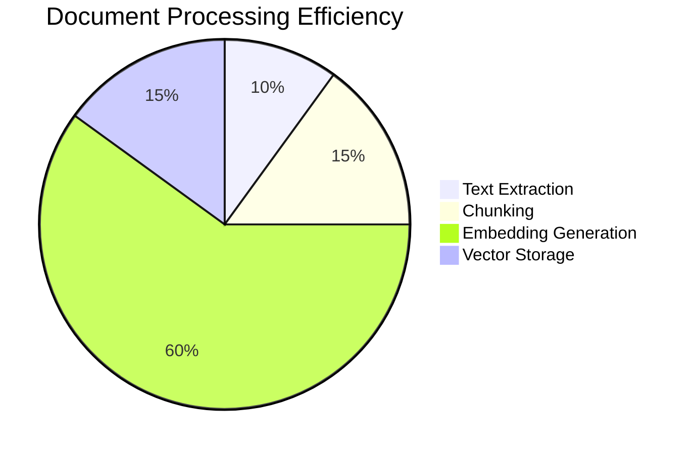

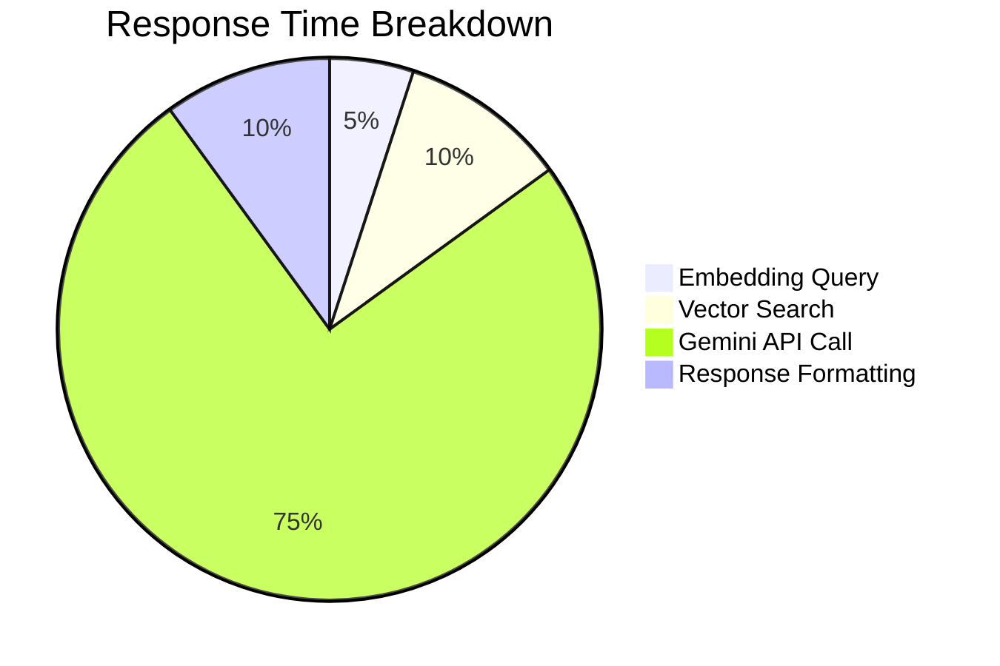

## Security & Privacy

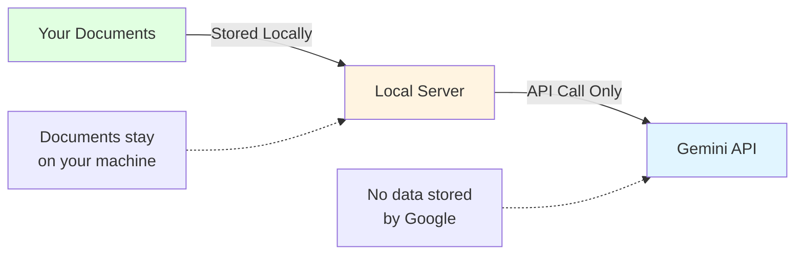

---

## Summary

**Learnix = Your Course Materials + AI Intelligence**

1. 📚 **Upload** your PDFs
2. 🔍 **Search** with natural language
3. 🤖 **Get** comprehensive AI-generated answers
4. ✅ **Verify** with source citations

All powered by cutting-edge RAG technology that combines the best of vector search and large language models!
