# Learnix Quick Reference - Visual Guide

## 🎯 One-Page Overview

### The RAG Pipeline (Simplified)

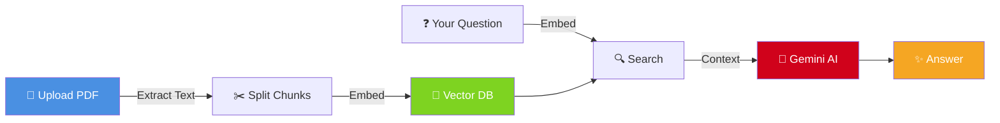

---

## 📊 3-Second Summary

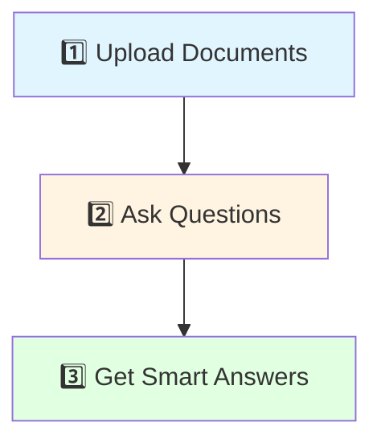

---

## 🔄 Request Flow (Detailed)

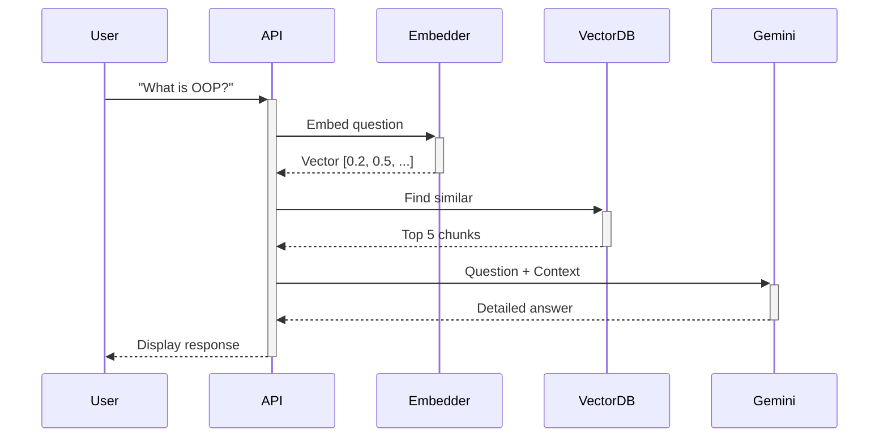

---

## 💾 Data Storage Structure

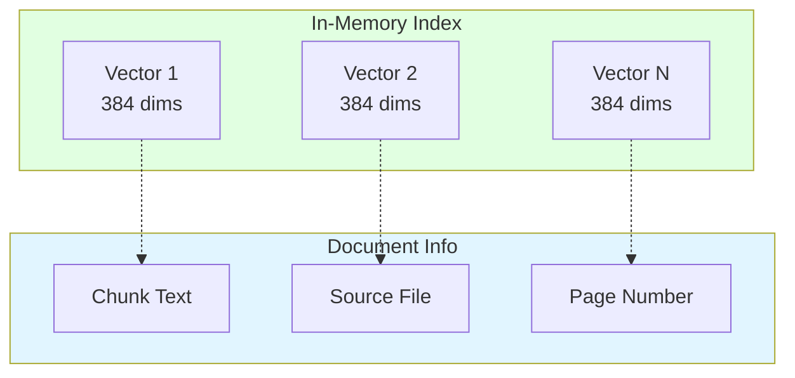

---

## ⚙️ Core Components

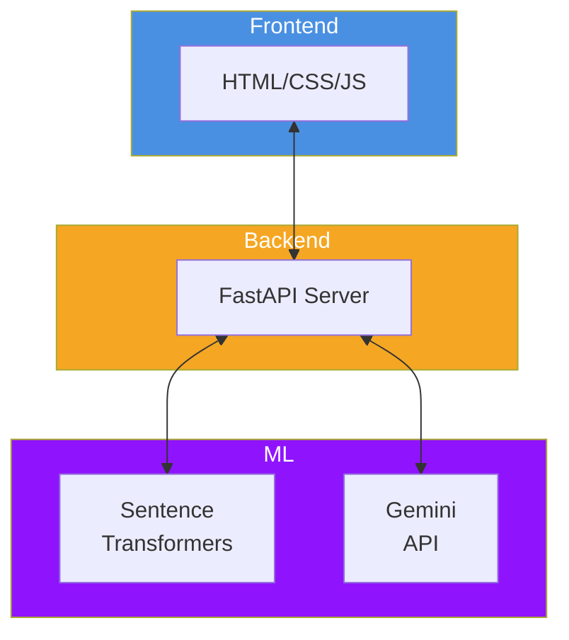

---

## 📈 Performance Breakdown

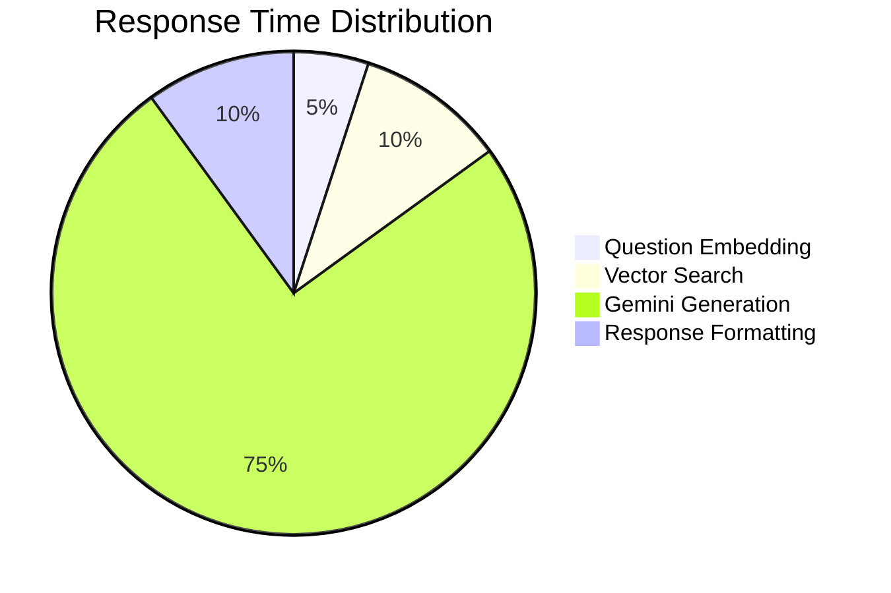

---

## 🔐 Security Model

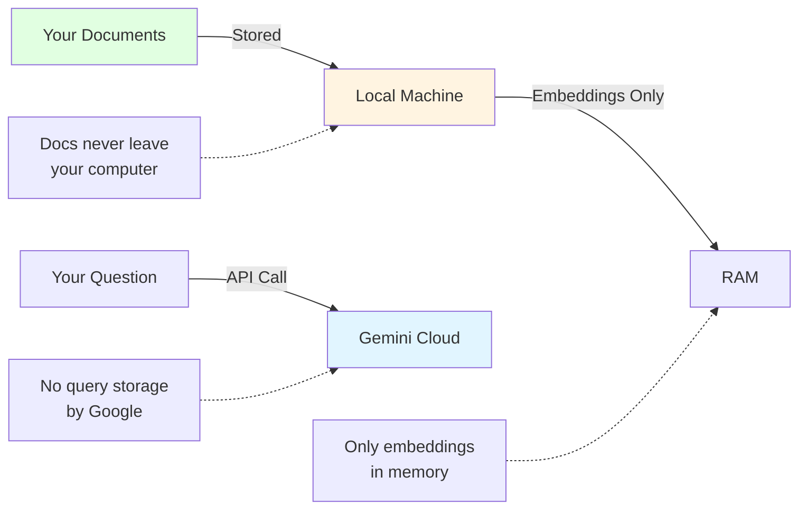

---

## 🎓 User Journey

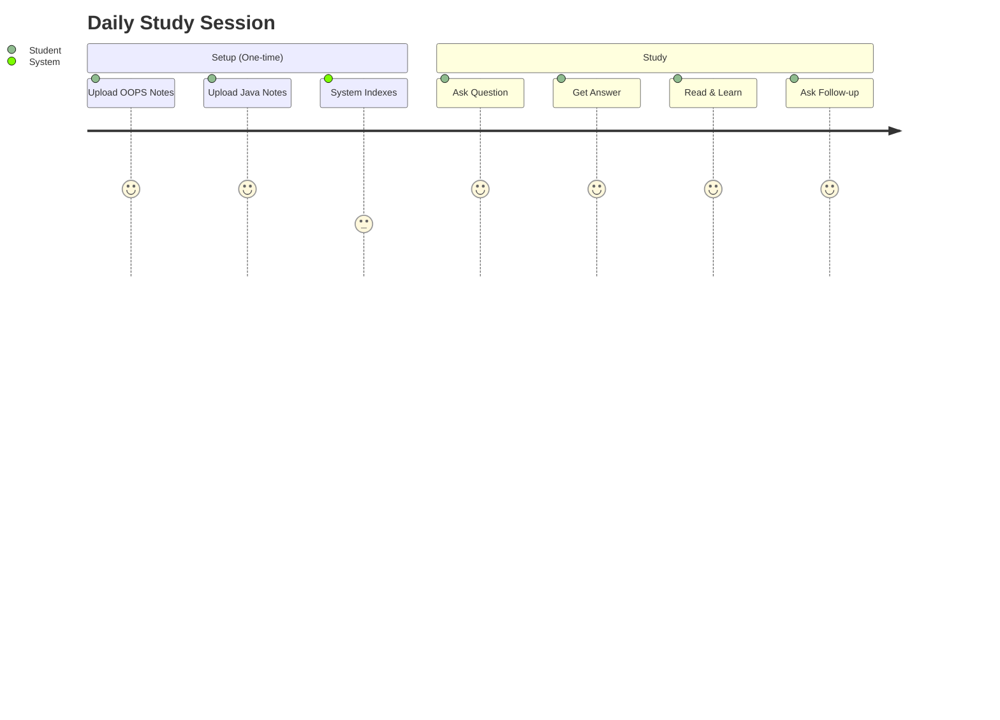

---

## 🛠️ Technology Matrix

| Layer | Technology | Purpose |
|-------|-----------|---------|
| **UI** | HTML/CSS/JS | Chat interface |
| **Server** | FastAPI | REST API |
| **Embedding** | all-MiniLM-L6-v2 | Text → Vectors |
| **Storage** | In-Memory Index | Fast retrieval |
| **LLM** | Gemini 1.5 Flash | Answer generation |
| **PDF** | PyPDF2 | Text extraction |

---

## ⚡ Quick Commands

### Start Server
```bash
cd college-ai-backend
uvicorn app:app --host 127.0.0.1 --port 8000
```

### Access App
```
http://127.0.0.1:8000
```

### API Health Check
```bash
curl http://127.0.0.1:8000/api/health
```

---

## 📝 API Endpoints

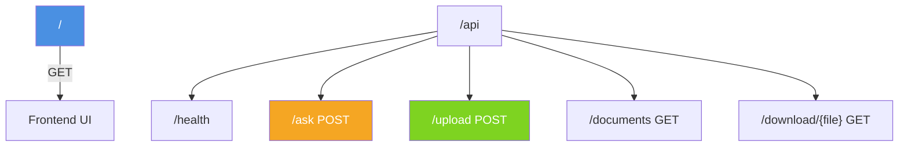

---

## 🎯 Best Practices

### ✅ DO
- Upload course-specific PDFs
- Ask detailed questions
- Use technical terms from your course
- Review source citations

### ❌ DON'T
- Ask about topics not in your docs
- Use extremely vague questions
- Expect answers without uploading materials
- Upload non-text PDFs (images only)

---

## 🐛 Quick Troubleshooting

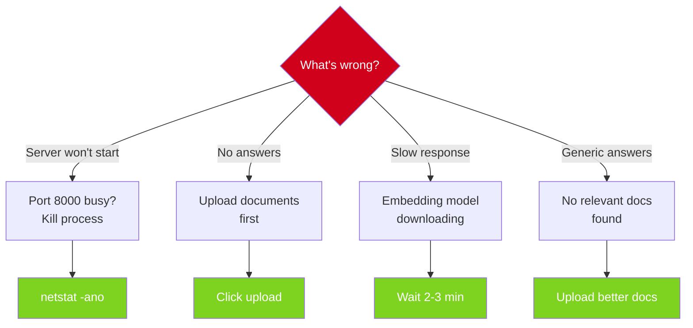

---

## 📚 File Structure (Simplified)

```
learnix/
├── assets/diagrams/      ← You are here
├── college-ai-backend/
│   ├── app.py           ← Main server
│   ├── frontend/        ← UI files
│   │   ├── index.html
│   │   ├── about.html
│   │   └── styles.css
│   ├── utils/           ← Core logic
│   │   ├── rag.py       ← RAG pipeline
│   │   ├── embeddings.py
│   │   └── gemini.py
│   └── data/            ← Your PDFs
└── README.md            ← Start here
```

---

## 🚀 From Zero to Answers

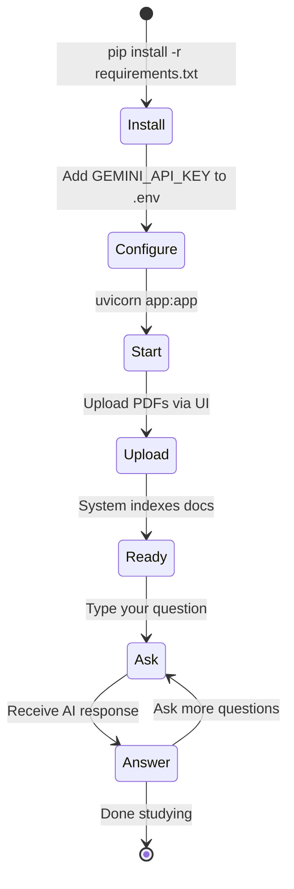

---

## 💡 Key Concepts

### Embeddings
Converting text to numbers that capture meaning:
```
"Object Oriented Programming" 
→ [0.23, -0.45, 0.67, ..., 0.12] (384 numbers)
```

### Cosine Similarity
How similar two vectors are (0-1 scale):
```
Question vector ⋅ Document vector = Similarity Score
Higher score = More relevant
```

### RAG
Retrieval + Generation = Accurate Answers:
```
Your Docs → Find Relevant → AI Generate → Answer
```

---

## 🎨 Color Legend

Throughout these diagrams:
- 🔵 **Blue** (`#4a90e2`) = User/Frontend
- 🟠 **Orange** (`#f5a623`) = Backend/API
- 🟢 **Green** (`#7ed321`) = Storage/Data
- 🟣 **Purple** (`#9013fe`) = ML/AI
- 🔴 **Red** (`#d0021b`) = External Services

---

## 📞 Need Help?

1. **Check**: [Full Documentation](../../README.md)
2. **Read**: [How It Works](how-it-works.md)
3. **Review**: [Architecture](system-architecture.md)
4. **Debug**: [Data Flow](data-flow.md)

---

**Print this page for quick reference! 📄**

*Last updated: October 27, 2025*
