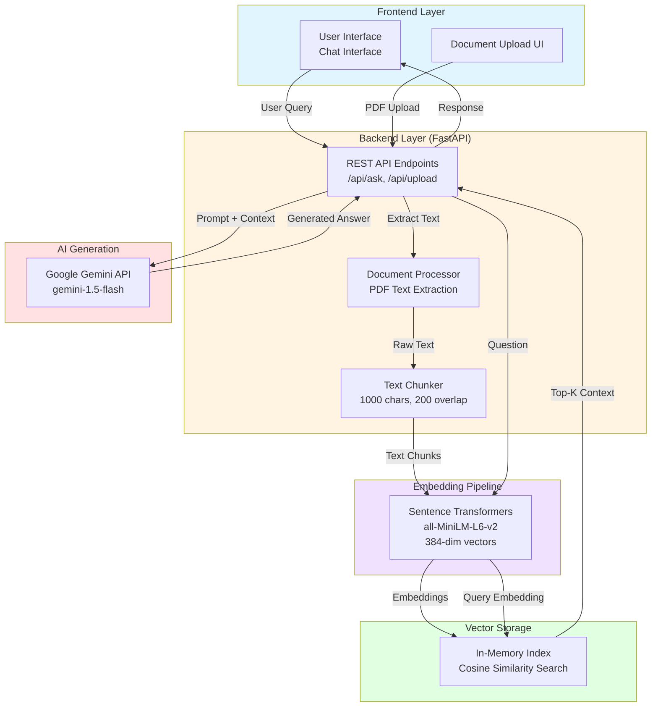
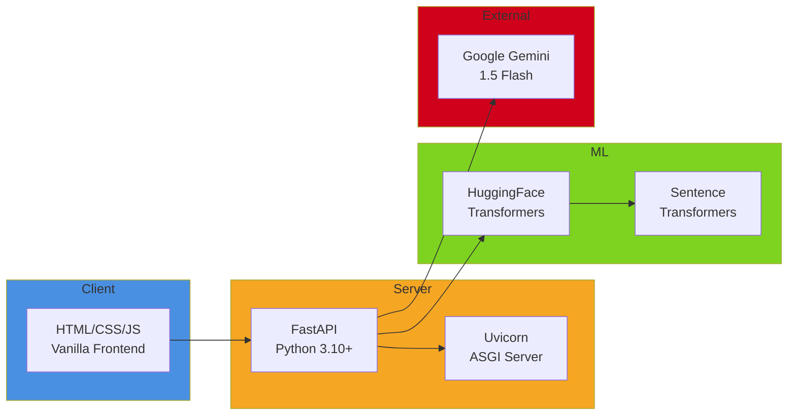

# Learnix System Architecture

## Complete System Overview

## Technology Stack

## Component Details

### Frontend
- **Technology**: Vanilla HTML, CSS, JavaScript
- **Features**: 
  - Chat interface with message history
  - PDF document upload
  - Dark/Light theme toggle
  - Real-time response streaming

### Backend (FastAPI)
- **Port**: 8000 (127.0.0.1)
- **Key Endpoints**:
  - `POST /api/ask` - Question answering
  - `POST /api/upload/` - Document upload
  - `GET /api/documents/` - List uploaded documents
  - `GET /api/download/{filename}` - Download documents
  - `GET /api/health` - Health check

### Document Processing Pipeline
1. **PDF Upload** → User uploads course materials
2. **Text Extraction** → PyPDF2 extracts text from PDFs
3. **Chunking** → Text split into 1000-char chunks with 200-char overlap
4. **Embedding** → Each chunk converted to 384-dim vector
5. **Storage** → Vectors stored in in-memory index

### Embedding Model
- **Model**: sentence-transformers/all-MiniLM-L6-v2
- **Dimensions**: 384
- **Device**: CPU (optimized for speed)
- **Purpose**: Convert text to semantic vectors

### Vector Search
- **Type**: In-Memory Index
- **Algorithm**: Cosine Similarity
- **Top-K**: Retrieves 5 most relevant chunks
- **Normalization**: L2 normalized embeddings

### LLM Integration
- **Model**: Google Gemini 1.5 Flash
- **Temperature**: 0.7 (balanced creativity)
- **Max Tokens**: 2048
- **Context Window**: Enhanced with retrieved documents
- **Prompt Engineering**: Comprehensive answer formatting
